# 🎭 Flusso dell'Evento (Orari Spazio Antro)

Un evento Artsy ad Antro segue un'architettura temporale fluida studiata per rispettare la chiusura dello spazio ed evitare disturbi al vicinato, garantendo al contempo il tempo necessario alla socialità e alla creazione.

---

## 🕒 Cronoprogramma Ufficiale (18:30 - 22:30)

```mermaid
gantt
    title Struttura di una Serata Artsy ad Antro
    dateFormat  HH:mm
    axisFormat %H:%M
    
    section Organizzazione
    Allestimento & Soundcheck :active, 17:00, 18:30
    section Flusso Partecipanti
    Accoglienza & Cena Condivisa : 18:30, 19:30
    Cerchio d'Apertura & Presentazione : 19:30, 19:45
    Pratica Libera & Workshop : 19:45, 21:45
    Climax Jam Session (Acustica) : 21:45, 22:15
    Chiusura & Fuori Tutti : 22:15, 22:30
```

### 1. Allestimento e Setup (17:00 - 18:30)
*   **Obiettivo**: Preparare lo spazio e mappare le aree prima dell'apertura delle porte.
*   **Azioni chiave**:
    *   Mappatura e posizionamento dei tavoli per stazioni (Musica, Scrittura, Disegno, Scultura).
    *   Allestimento tovaglie cerate e disposizione materiali d'arte.
    *   Installazione luci d'atmosfera calde (fairy lights, lampade) ed esclusione neon a soffitto.
    *   Setup del proiettore nel salone principale per i visual grafici.
    *   Predisposizione dell'Area Cibo (scontrini e schede allergeni alla mano) e posizionamento dei cartelli QR Code per le donazioni digitali.

### 2. Accoglienza e Cena Condivisa (18:30 - 19:30)
*   **Obiettivo**: Rompere il ghiaccio tramite l'incontro e la condivisione del cibo.
*   **Azioni chiave**:
    *   I partecipanti vengono accolti all'ingresso, dove acquistano la tessera di Antro (se sprovvisti).
    *   I cibi confezionati/comprati portati dai partecipanti vengono controllati (presenza scontrino e ingredienti) e disposti sul tavolo buffet.
    *   Il bar di Antro è attivo per la somministrazione di bevande.
    *   Fase informale di accoglienza e socializzazione.

### 3. Cerchio di Apertura (19:30 - 19:45)
*   **Obiettivo**: Presentare la filosofia di Artsy (no giudizio, sì sperimentazione) e l'eventuale micro-tema.
*   **Azioni chiave**:
    *   Discorso introduttivo tenuto dal coordinatore.
    *   Illustrazione delle regole dello spazio (rispetto dei materiali, barattolo QR per offerte digitali, no alcolici da fuori).
    *   Presentazione del workshop speciale della serata.

### 4. Pratica Artistica Libera e Workshop (19:45 - 21:45)
*   **Obiettivo**: Immersione nel lavoro creativo ed esplorazione delle stanze a tema.
*   **Azioni chiave**:
    *   I partecipanti girano liberamente tra le postazioni di scultura, disegno, scrittura, cucito.
    *   Si innescano mentorship spontanee tra pari.
    *   Avvio del workshop dedicato in una delle aree preposte.

### 5. Climax della Sinergia (Jam Session Acustica) (21:45 - 22:15)
*   **Obiettivo**: Unione delle diverse aree creative in un'improvvisazione finale.
*   **Azioni chiave**:
    *   I musicisti avviano la jam session a volume moderato (senza amplificazione pesante).
    *   Pescaggio di testi e poesie scritti nella serata dall'Area Scrittura per essere cantati o musicati sul momento.
    *   Visual artist proiettano creazioni in tempo reale sul proiettore del salone.

### 6. Chiusura e Saluti (22:15 - 22:30)
*   **Obiettivo**: Riordino e sgombero dello spazio.
*   **Azioni chiave**:
    *   Interruzione di tutta la musica entro le 22:15/22:20 per non disturbare i vicini.
    *   Riordino dei materiali.
    *   **Tutti fuori alle 22:30** per permettere al team di Antro di chiudere lo spazio.
